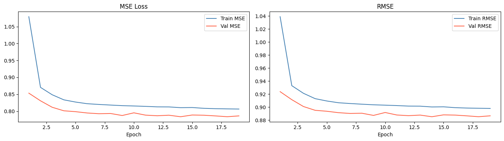
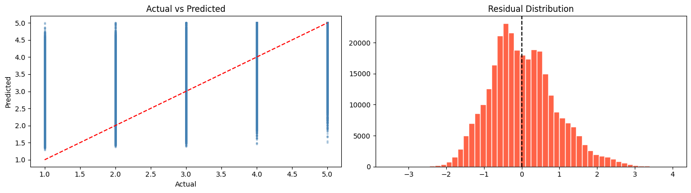

# MovieRecommendationNotebook- #author : Shivam Bhardwaj
Here i implemeneted movie recommender using pytorch
A machine learning-based recommendation system built using **PyTorch**, designed to predict user-item interactions and provide personalized recommendations.

This project demonstrates end-to-end ML pipeline: data preprocessing, model training, evaluation, and inference.

#Project Overview

This recommendation system learns patterns from user behavior data and suggests relevant items using a neural network-based approach.

# DataSet used here : 
I used MovieLens 1M dataset to train this model here 

Link : [text](https://grouplens.org/datasets/movielens/1m/)

#  Key Features

- ✔ Neural network-based recommendation model (PyTorch)
- ✔ User-item interaction learning
- ✔ Scalable architecture for large datasets
- ✔ Training + validation pipeline
- ✔ Prediction API ready structure (FastAPI compatible)
- ✔ Saved model inference support

# Tech Stack

- Python 
- PyTorch 
- NumPy
- Pandas
- Scikit-learn
- Matplotlib (for analysis)

A simple yet powerful neural network:

- Input Layer: User & Item embeddings / features
- Hidden Layers: Fully connected layers + ReLU
- Output Layer: Score / probability of interaction

Loss Function:
- Binary Cross Entropy / MSE (based on dataset)

Optimizer:
- Adam Optimizer

# Result of my training process :
## 📊 Model Output

Training Accuracy : 
    Average RMSE : 0.8857
Testing Accuracy : 
    Average RMSE : 0.8880

# Testing over my testing data 

